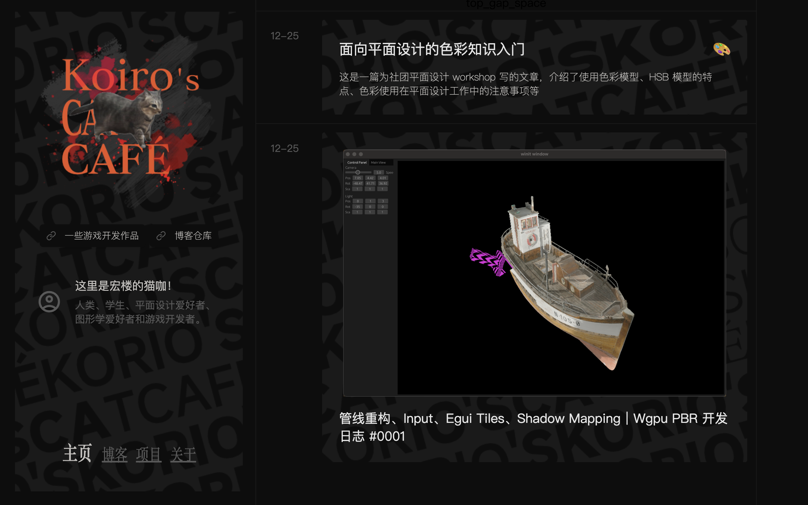

# Kotlin + Notion = Blog
This is my website (static) repository.  

It is powered by:
- [Kotlin (JVM)](https://kotlinlang.org/) 
- [Notion](https://kotlinlang.org/)
- [notion-sdk-jvm](https://github.com/seratch/notion-sdk-jvm)
- [kotlinx-html](https://github.com/Kotlin/kotlinx.html)
- [Scss](https://sass-lang.com/)
